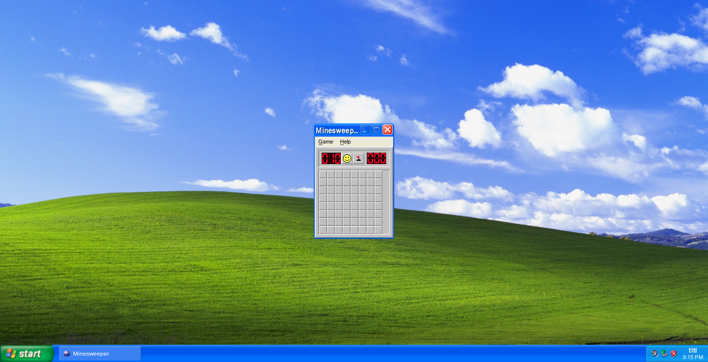
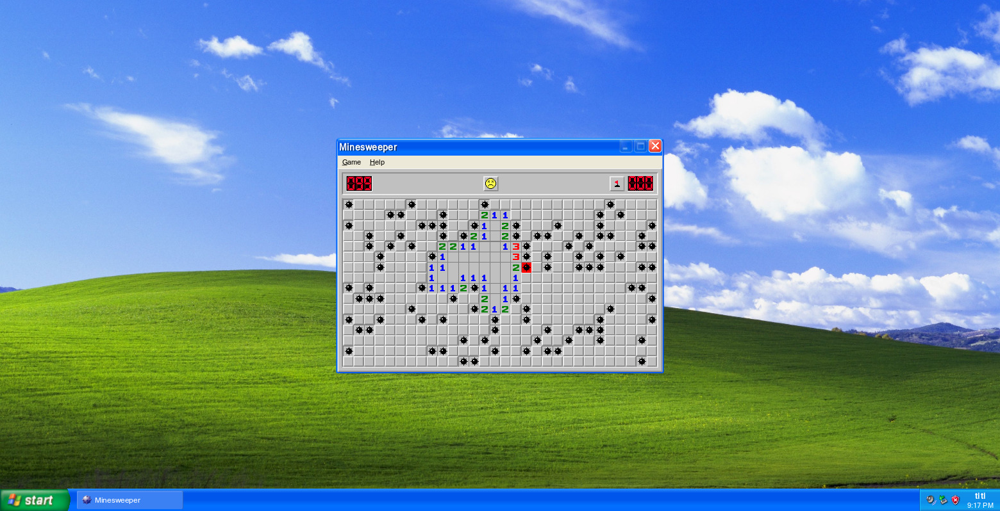
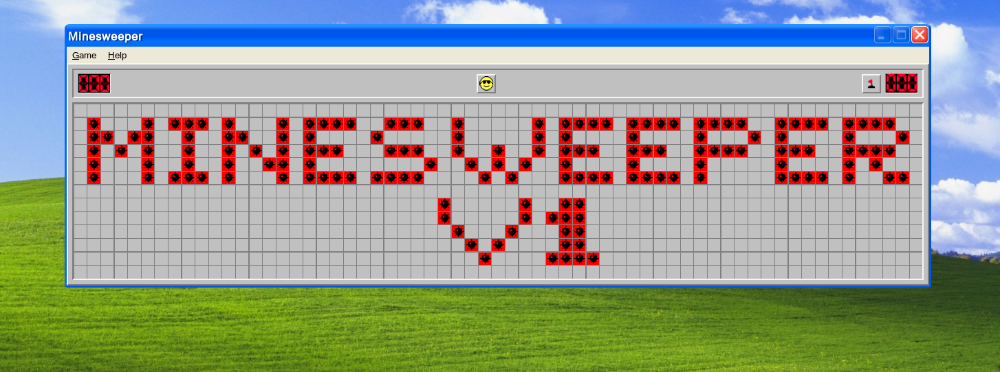

# No-JS Minesweeper

## Introduction

Because we love PHP, and we are, as we say in french, 'des drapeauteurs', we made an entire Minesweeper in PHP.
Don't try to find any JS function, it's full of emptiness here.

In accordance to PSR-2.

## Features

- A CSS Timer
- Fully featured copy of the minesweeper
- Different levels of difficulty
- Sounds (yes that's possible)

## Demonstration :

[https://minesweeper.app.simonwork.fr](https://minesweeper.app.simonwork.fr)

- Username: `titi`
- Password: `titi`

## Screenshots

## Self hosting (installation)

Minimum PHP version: `7.4`

Composer is also required

- Clone this project
- Create a new database in MariaDB
- Insert data from file `demineur.sql`
- Copy past `Config/config.php.example` to `Config/config.php`
- Edit `Config/config.php` with DB credentials
- Run `composer install`
